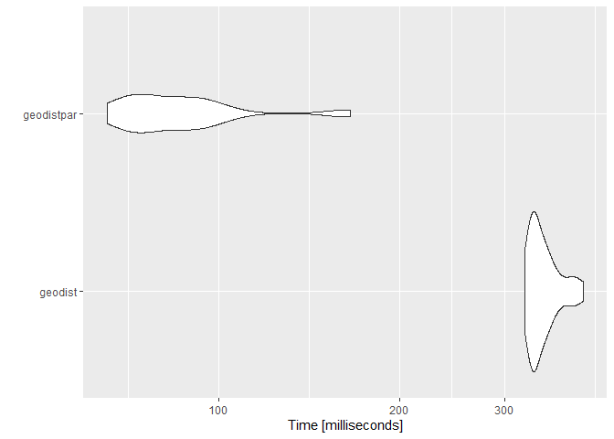
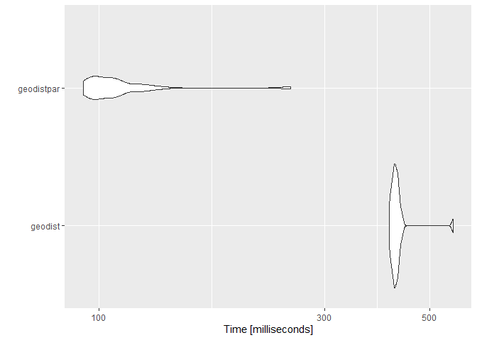

<!-- README.md is generated from README.Rmd. Please edit that file -->

# geodistpar

<!-- badges: start -->

<!-- badges: end -->

<!-- The goal of geodistpar is to ... -->

<!-- ## Installation -->

<!-- You can install the released version of geodistpar from [CRAN](https://CRAN.R-project.org) with: -->

<!-- ``` r -->

<!-- install.packages("geodistpar") -->

<!-- ``` -->

And the development version from [GitHub](https://github.com/) with:

``` r
# install.packages("devtools")
devtools::install_github("mkuehn10/geodistpar")
```

## Example

``` r
library(geodistpar)
library(geodist)
library(microbenchmark)
library(ggplot2)

set.seed(10)
n <- 1000
x <- cbind (-10 + 20 * stats::runif (n), -10 + 20 * stats::runif (n))
y <- cbind (-10 + 20 * stats::runif (2 * n), -10 + 20 * stats::runif (2 * n))
colnames (x) <- colnames (y) <- c ("x", "y")

a <- geodist::geodist(x, y, measure = "haversine")
b <- geodistpar::geodistpar(x, y, measure = "haversine")

head(a[, 1:5])
#>           [,1]      [,2]      [,3]      [,4]      [,5]
#> [1,] 1225210.6 1788146.1  243415.8  941220.4 1184245.2
#> [2,] 1421649.3 1443725.5  693979.4 1436373.5 1146991.8
#> [3,]  990672.7  670982.9 1244972.4 1948938.0  381055.2
#> [4,]  459949.5 1496824.5  618702.2 1158123.6  549935.1
#> [5,] 1760882.6 1120247.4 1259339.6 2018837.7 1300613.0
#> [6,] 1399721.5  581798.6 1311268.4 2083635.0  828119.6
head(b[, 1:5])
#>           [,1]      [,2]      [,3]      [,4]      [,5]
#> [1,] 1225210.6 1788146.1  243415.8  941220.4 1184245.2
#> [2,] 1421649.3 1443725.5  693979.4 1436373.5 1146991.8
#> [3,]  990672.7  670982.9 1244972.4 1948938.0  381055.2
#> [4,]  459949.5 1496824.5  618702.2 1158123.6  549935.1
#> [5,] 1760882.6 1120247.4 1259339.6 2018837.7 1300613.0
#> [6,] 1399721.5  581798.6 1311268.4 2083635.0  828119.6
identical(a, b)
#> [1] TRUE

mb1 <- microbenchmark::microbenchmark(
  geodist = geodist::geodist(x, y, measure = "haversine"),
  geodistpar = geodistpar::geodistpar(x, y, measure = "haversine"),
  times = 25
)

mb1
#> Unit: milliseconds
#>        expr      min       lq      mean   median       uq      max neval
#>     geodist 323.6862 333.0647 348.49044 338.5571 355.1795 405.8613    25
#>  geodistpar  65.1556  73.1052  88.33825  81.3975  92.8390 165.5609    25
#>  cld
#>    b
#>   a
autoplot(mb1)
#> Coordinate system already present. Adding new coordinate system, which will replace the existing one.
```



``` r

a <- geodist::geodist(x, y, measure = "vincenty")
b <- geodistpar::geodistpar(x, y, measure = "vincenty")

head(a[, 1:5])
#>           [,1]      [,2]      [,3]      [,4]      [,5]
#> [1,] 1225210.6 1788146.1  243415.8  941220.4 1184245.2
#> [2,] 1421649.3 1443725.5  693979.4 1436373.5 1146991.8
#> [3,]  990672.7  670982.9 1244972.4 1948938.0  381055.2
#> [4,]  459949.5 1496824.5  618702.2 1158123.6  549935.1
#> [5,] 1760882.6 1120247.4 1259339.6 2018837.7 1300613.0
#> [6,] 1399721.5  581798.6 1311268.4 2083635.0  828119.6
head(b[, 1:5])
#>           [,1]      [,2]      [,3]      [,4]      [,5]
#> [1,] 1225210.6 1788146.1  243415.8  941220.4 1184245.2
#> [2,] 1421649.3 1443725.5  693979.4 1436373.5 1146991.8
#> [3,]  990672.7  670982.9 1244972.4 1948938.0  381055.2
#> [4,]  459949.5 1496824.5  618702.2 1158123.6  549935.1
#> [5,] 1760882.6 1120247.4 1259339.6 2018837.7 1300613.0
#> [6,] 1399721.5  581798.6 1311268.4 2083635.0  828119.6
identical(a, b)
#> [1] TRUE

mb2 <- microbenchmark::microbenchmark(
  geodist = geodist::geodist(x, y, measure = "vincenty"),
  geodistpar = geodistpar::geodistpar(x, y, measure = "vincenty"),
  times = 25
)

mb2
#> Unit: milliseconds
#>        expr      min       lq     mean   median       uq      max neval
#>     geodist 410.2383 419.1674 427.9974 422.2964 427.4931 560.3288    25
#>  geodistpar  92.6750  97.3471 111.8878 105.1134 110.0495 253.5281    25
#>  cld
#>    b
#>   a
autoplot(mb2)
#> Coordinate system already present. Adding new coordinate system, which will replace the existing one.
```


